# Pokémon Safari Gauntlet

Safari Gauntlet is a self-contained challenge game built on top of [Pokémon Polished Crystal](https://github.com/Rangi42/polishedcrystal), which itself is based on [the Pokémon Crystal disassembly](https://github.com/pret/pokecrystal).

Instead of playing the full Johto/Kanto adventure, you enter a compact roguelite-style facility: bring or receive one Pokémon, draft a team in the Safari Zone, climb a short battle ladder, earn BP, and keep one winner for future runs.

This project is derived from the official [Polished Crystal 3.2.3](https://github.com/Rangi42/polishedcrystal/releases/tag/v3.2.3) codebase. It inherits Polished Crystal's modernized battle system, expanded Pokédex, quality-of-life work, maps, music, graphics, and engine improvements, then adds the Safari Gauntlet mode, release packaging, title branding, and focused emulator verifiers.

> There are many ways to create games but the way we work at Game Freak may be a little different from other companies. That is, we constantly change and tweak what we have come up with. To make a fun game even more fun and polish it up, we take what we have made and start thinking about it from scratch.
>
> - Junichi Masuda, "[HIDDEN POWER of masuda No. 7](https://www.gamefreak.co.jp/blog/dir_english/?p=21)"

## Download and Play

The current Safari Gauntlet release target is **v1.0.1**.

Release artifacts are built with the repo-local release helper:

```bash
python3 utils/build_safari_release_artifacts.py --base-rom /path/to/clean-crystal.gbc
```

The clean base ROM should be:

```text
Pokemon - Crystal Version (UE) (V1.0) [C][!].gbc
MD5: 9f2922b235a5eeb78d65594e82ef5dde
```

The release helper follows Polished Crystal's release layout and writes artifacts such as:

```text
build/safari-gauntlet-1.0.1.gbc
build/safari-gauntlet-1.0.1.sym
build/safari-gauntlet-1.0.1.bps
build/safari-gauntlet-1.0.1.ips
build/safari-gauntlet-1.0.1.3ds-vc.patch
```

If you are building locally without release patches, run:

```bash
make -j8
```

Then load the built `.gbc` in an accurate Game Boy Color emulator such as [mGBA](https://mgba.io/), [SameBoy](https://sameboy.github.io/), [BGB](https://bgb.bircd.org/), or Gambatte. Do not use VBA or VBA-M.

## What Is Safari Gauntlet?

Safari Gauntlet turns Polished Crystal into a repeatable draft-and-battle challenge.

- Start in a sealed Battle Factory-style hub with a nurse, PC access, settings, shops, a move reminder, and the run desk.
- Enter with exactly one Pokémon, or disable carry-ins and receive a level 35 Eevee starter.
- Draft normally in the Safari Zone with Safari Balls, regular balls, a Super Rod, limited steps, and limited supplies.
- Catch at least four Pokémon, up to a full party of six, before returning to the hub.
- Fight four trainer rounds and then a boss battle.
- Win BP after each round and a larger BP payout for the boss.
- On victory, keep one Pokémon in the Safari Keep Box for future carry-in choices.

## Safari Features

- **Safari draft field:** a 500-step draft zone with common Pokémon near the entrance, stronger role players to the east and west, and rare anchors in the north.
- **Run supplies:** the run desk loads balls, healing items, Repels, Rare Candies, evolution stones, a Master Ball, and a Super Rod.
- **Three difficulties:** Casual, Standard, and Hard adjust supply pressure and boss handling.
- **Draft pool settings:** choose Johto or National-style Safari draft pools.
- **Carry-in settings:** use your newest kept Pokémon, pick another stored keep, or turn carry-ins off for the Eevee starter path.
- **Boss reveal setting:** choose whether the run desk reveals the final boss before the draft.
- **Battle ladder:** four trainer rounds followed by one of Chuck, Jasmine, Pryce, or Clair as the boss.
- **BP economy:** earn BP during runs and spend it on hub shops, including a focused TM vendor.
- **Keep Box:** winning stores one selected Pokémon, normalizes it for future runs, and supports up to 30 kept Pokémon.
- **Focused verification:** Safari Gauntlet behavior is covered by mGBA Lua verifiers in `tools/safari_gauntlet_verify_*.lua`.

## Inherited From Polished Crystal

Safari Gauntlet keeps Polished Crystal's larger game foundation. See [FEATURES.md](FEATURES.md), [FAQ.md](FAQ.md), and [CREDITS.md](CREDITS.md) for the full upstream feature and credit surface.

Highlights include:

- 289 Pokédex entries, plus later-generation evolutions, forms, and variants related to Gen 1 and Gen 2 Pokémon.
- Modernized mechanics such as the Fairy type, Physical/Special split, Natures, Abilities, updated moves, and updated type interactions.
- Expanded move, TM, tutor, item, held-item, and battle-engine systems.
- Quality-of-life features such as unlimited-use TMs, Running Shoes, continuous Repel prompts, improved storage, and richer summary screens.
- Restored, expanded, and devamped Johto/Kanto content from R/B/Y, HG/SS, and later Pokémon games.
- New music, graphics, maps, events, trainer classes, and postgame systems from Polished Crystal's long-running development.

## Credits

Safari Gauntlet exists because of the Pokémon Crystal disassembly and Pokémon Polished Crystal.

- [pret](https://github.com/pret/pokecrystal) created and maintains the Pokémon Crystal disassembly that makes this kind of source-level work possible.
- [Rangi42](https://github.com/Rangi42) and the [Polished Crystal contributors](https://github.com/Rangi42/polishedcrystal) designed and developed the game this project is derived from.
- Polished Crystal's documentation, release flow, feature set, credits, and source organization are the baseline for this project.
- Safari Gauntlet adds the challenge format, hub flow, draft/run rules, title branding, release packaging, and project-specific verification work.

This is an unofficial fan project. Pokémon is owned by Nintendo, Game Freak, and The Pokémon Company.

## Screenshots

### Title and Hub

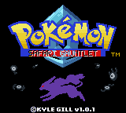
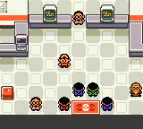

### Draft Field and Battles


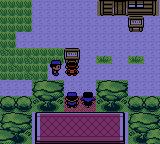
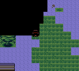
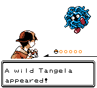
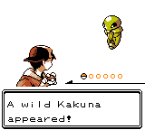
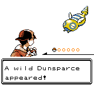

### Party and Storage

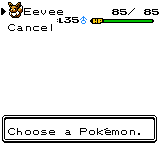
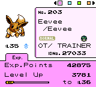
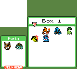

### Hub Services

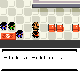
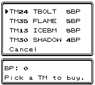
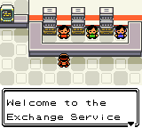
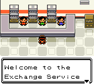
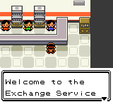
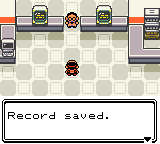
